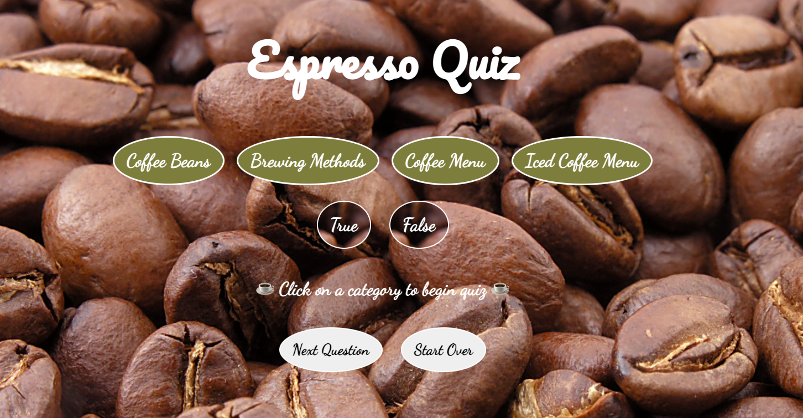

Espresso Quiz <a href= https://espresso-quiz.netlify.app/ >Play Game</a>

Espresso Quiz Game is a true and false quiz. The user is given four categories to choose from. Once a category is selected a question is displayed, to move on to the next question select "Next Question". A countdown timer gives 30 seconds to answer all questions in a given category and the score is tracked as questions are answered.

This game was created using Javascript, HTML and CSS.

<a href= https://espresso-quiz.netlify.app/ >Play Game</a>

Next Steps: Create more questions and categories. Reformat display so only one category is displayed at a time. Create scoring and allow it to display what was scored in each category at the end.
